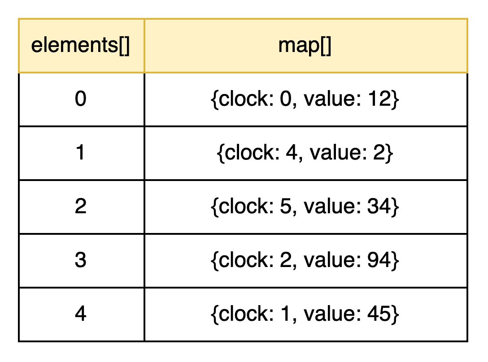

# Mémoire fonctionnelle - TD1
###### D'Andréa William

#### Acknowledgment
Ce rapport, est (surement) beaucoup trop détaillé par rapport à ce que vous demandez. Cependant, mon but est que, si dans
5 ans j'ai besoin de ce travail, je le comprenne à nouveau juste en relisant mon rapport, donc je le détaille énormément 
dans ce but, et ce serait dommage d'en écrire 2 versions :)


Afin d'expliciter au mieux la démarche, ce rapport va retracer les différentes étapes de l'implémentation
du STM, et expliquer le pourquoi de l'implémentation.


### 1. Création de la classe `Value`

```java 
public class Value {
    public Integer value;
    public int counter;

    public Value(int value, int counter) {
        this.value = value;
        this.counter = counter;
    }

    @Override
    public String toString() {
        return "Value : { value=" + value + ", counter=" + counter + '}';
    }
}
```

La classe `Value` a pour objectif de décrire une valeur en mémoire. La mémoire va contenir plusieurs
`Value` qui sont décrite par un compteur et une valeur. 

### 2. Création de la classe `Memory`

```java
public class Memory {
    public Value[] values;
    public int clock;
    public static Memory memory = new Memory(1024);
    
    public Memory(int size) {
        this.clock = 1;
        this.values = new ArrayList<Value>(Collections.nCopies(size, new Value(0, 0))).toArray(new Value[0]);
    }
}
```

Une `Memory` va contenir plusieurs `Value` qui sont initialisé avec une valeur à 0 et un compteur à 0.
Une memoire possède aussi une horloge locale qui agira de point de référence pour les transactions. Pour faire
simple, la clock sera incrémenté après chaque `commit`, elle va donc compter le nombre de bloc atomique qui
ont été exécuté.

Afin de faciliter l'implémentation de notre code, nous avons créer un attribut statique qui contient une 
mémoire de taille 1024 (cette mémoire aura donc 1024 `Value`. Par la suite, dans le code, nous n'instancierons pas de nouvelle mémoire, nous appelerons
juste cet attribut statique qui agira de mémoire pour toute notre exécution. 


### 3. Création de la classe `TransactionAbort`

```java
public class TransactionAbort extends Exception {

    public TransactionAbort() {
        super();
    }
}
```

Cette exception sera levé lorsqu'une transaction est avortée. En général, une transaction est avorté lorsque 2 threads
essayent de modifier une même valeur en mémoire simultanément. Nous y reviendrons plus tard

### 4. Création de la classe `ValueSet`

```java
public class ValueSet {

    // Tableau contenant toutes les valeurs du read/write set
    public Value map[];
    // Tableau contenant les indices utilisés dans le tableau map.
    public int elements[];
    // Nombre d'indices utilisés.
    public int n_elements;
    
    public ValueSet(int max) {
        this.map = new Value[max];
        this.elements = new int[max];
    }

    // Récupérer la valeur à un indice.
    Value get(int idx) {
        // On renvoie juste la valeur à l'indice donné (sera peut-être null).
        return map[idx];
    }
    
    // Mettre une valeur à un indice.
    boolean set(int idx, Value val) {
        // Si l'index est déjà utilisé, on renvoie true (val est ignoré).
        if (get(idx) != null)
            return true;

        // Sinon, on enregistre l'indice comme utilisé...
        elements[n_elements++] = idx;
        // ...et on met la valeur à cet indice.
        map[idx] = val;

        return false;
    }

    // Effacer le set.
    void clear() {
        // Seuls les indices utilisés pointent vers des valeurs non-nulles.
        for (int i = 0; i < n_elements; i++)
            map[elements[i]] = null;
        n_elements = 0;
    }

    public boolean checkRead(int clock) {
        // Implémentation dans les prochaines parties du rapport
    }

    public boolean checkWrite(int clock) {
        // Implémentation dans les prochaines parties du rapport
    }
}
```

Cette classe a pour objectif de gérer les `ReadSet` et les `WriteSet`. Ces 2 éléments seront donc décrits
par la classe `ValueSet`. 
Un `ReadSet` contient toutes les `Value` qui ont été lu durant une transaction atomique et un `WriteSet` contient toutes 
les `Value` qui ont été écrité durant une transaction atomique. 

L'implémentation de `ValueSet` permet de stocker ces `Value` lu ou écrite dans la liste `map` et la liste `elements` 
contient les emplacements en mémoire des `Value` incluses dans `element` (c'est en gros les index de chaques `Value` 
(lue ou écrite) de la liste `values` dans l'instance `Memory`).



Les méthodes `get`, `set` et `clear` permettent de réaliser des opérations sur ces 2 listes. Nous reviendrons plus tard
sur les méthodes `checkRead` et `checkWrite`. 

### 5. Implémentation de la classe `Transaction`

```java
public class Transaction {
    private ValueSet writeSet;
    private ValueSet readSet;
    private int clock;

    public static int commitSuccess = 0;
    public static int commitAbort = 0;

    private Transaction() {
        int mem_size = Memory.memory.values.length;
        writeSet = new ValueSet(mem_size);
        readSet  = new ValueSet(mem_size);
    }

    public static ThreadLocal<Transaction> Transaction =
            new ThreadLocal<Transaction>() {
                protected synchronized Transaction initialValue() {
                    return new Transaction();
                }
            };

    public void abort() throws TransactionAbort {
        commitAbort++;
        throw new TransactionAbort();
    }

    public void begin() {
        this.clock = Memory.memory.clock;
    }

    public int read(int idx) throws TransactionAbort {
        // Si la Value se trouve dans le write set, on renvoie sa valeur.
        // C'est dans le write set si on l'a déjà modifié auparavant
        if (this.writeSet.get(idx) != null) {
            return this.writeSet.map[idx].value;
        }

        Value value = Memory.memory.values[idx];
        // On vérifie que le compteur de la Value est inférieur à l'horloge locale
        // Si le compteur de la value est supérieur au compteur local, cela veut dire qu'un autre thread à modifier cette valeur
        // et que l'on doit donc avorter la transaction.
        if (value.counter >= this.clock) {
            abort();
        }

        this.readSet.set(idx, value);
        return value.value;
    }

    public void write(int idx, int value) throws TransactionAbort {
        if (this.writeSet.get(idx) != null) {
            this.writeSet.map[idx].value = value;
        } else {
            this.writeSet.set(idx, new Value(value, 0));
        }
    }

    public void commit() throws TransactionAbort {
        // Implémentation dans les prochaines parties du rapport
    }
}
```

Une transaction est une suite d'opération qui doivent être atomique. Atomique signifie qu'une transaction
n'a que 2 issues possibles, soit toutes les opérations des transactions réussissent, et dans ce cas-là, la transaction
se termine par un `commit`, soit il y a un problème lors d'une opération de la transaction, et dans ce cas-là, la transaction
`abort` et nous devons l'exécuter à nouveau (en repartant de 0). 

Avant de commencer une transaction, nous devons caller notre horloge locale (horloge de la transaction) sur l'horloge 
globale (horloge de la memory), c'est pour cela que nous initialisons la transaction avec cette méthode :
```java
public void begin() {
    this.clock = Memory.memory.clock;
}
```

Il y a 2 opérations possibles, soit nous souhaitons lire une donnée en mémoire, soit nous souhaitons écrire une donnée en mémoire. 

##### Ecriture d'une variable
```java
public void write(int idx, int value) throws TransactionAbort {
    if (this.writeSet.get(idx) != null) {
        this.writeSet.map[idx].value = value;
    } else {
        this.writeSet.set(idx, new Value(value, 0));
    }
}
```

Lorsque l'on souhaite écrire une nouvelle variable, nous devons d'abord regarder si cette valeur existe dans notre `writeSet`.
Si elle y existe déjà, nous la remplaçons juste dedans. Cependant, si elle n'existe pas encore dans le `writeSet`, nous l'ajoutons


##### Lecture d'une variable

```java
public int read(int idx) throws TransactionAbort {
    // Si la Value se trouve dans le write set, on renvoie sa valeur.
    // C'est dans le write set si on l'a déjà modifié auparavant
    if (this.writeSet.get(idx) != null) {
        return this.writeSet.map[idx].value;
    }

    Value value = Memory.memory.values[idx];
    // On vérifie que le compteur de la Value est inférieur à l'horloge locale
    // Si le compteur de la value est supérieur au compteur local, cela veut dire qu'un autre thread à modifier cette valeur
    // et que l'on doit donc avorter la transaction.
    if (value.counter >= this.clock) {
        abort();
    }

    this.readSet.set(idx, value);
    return value.value;
}
```

Comme précédemment, nous devons d'abord regarder si la variable que l'on souhaite lire est déjà présente dans le `writeSet` (
si elle y est présente, sela signifie que dans cette transaction, une opération a déjà modifié la variable, il faut donc prendre celle la en compte).
Cependant, si elle n'existe pas encore dans le `writeSet`, dela veut dire que personne n'a encore utilisé cette variable dans notre
transaction, on peut donc aller lire en mémoire quelle est la valeur de cette variable.

Cependant, nous retrouvons un problème. Que se passe-t-il si une autre transaction modifie cette même valeur ? Si c'est
le cas, cette transaction ne sera pas atomique, car 2 transactions auront essayé de modifier la même valeur en même temps.

C'est pour éviter ce problème que nous avons l'attribut `clock` interne à la transaction. En effet, logiquement, si personne n'a
touché à la `Value` en `Memory`, personne n'a donc touché à son attribut `counter`, et donc, ce `counter` devrait être inférieur 
à `this.clock` (car nous l'avons initialisé en début de transaction). Si ce n'est pas le cas, un autre thread a modifier cette valeur,
et donc, pour garder l'atomicité, nous devons avorter la transaction. Cependant, si personne n'a touché a cette variable en mémoire
durant l'exécution de notre opération, nous pouvons ajouter la valeur au `readSet`. 

### 6. Implémentation du `commit`

```java 
public class Transaction {
    public void commit() throws TransactionAbort {
        synchronized(Memory.memory) {
            if(!readSet.checkRead(clock)) {
                readSet.clear();
                writeSet.clear();
                abort();
            }
            if(!writeSet.checkWrite(clock)) {
                writeSet.clear();
                abort();
            }
            
            readSet.clear();
            writeSet.clear();
    
            Memory.memory.clock++;
            commitSuccess++;
        }
    }
}
```

Lorsque nous avons finalisé une transaction, nous voulons `commit` les opérations que nous avons faites dans notre transaction 
en mémoire. 
D'abord, nous utilisons la méthode java `synchronized` pour vérifier que nous sommes la seule transaction à aller 
executer quelque chose en `Memory`. D'abord, nous allons regarder si le `readSet` est valide, s'il n'est pas valide, nous
devons avorter la transaction et nettoyer le `readSet` et le `writeSet` car, au moment d'un `abort()`, nous allons 
réexecuter notre transaction jusqu'à succès, il faut donc repartir avec des "données propres". 

Nous avons la même démarche pour le `writeSet`, sauf que nous allons juste nettoyer le `writeSet`, car il n'est pas nécessaire
de nettoyer le `readSet`. 

Si tout se passe bien, nous pouvons `commit` la transaction en mémoire, pour cela, nous nettoyons au préalable `readSet` 
et `writeSet` pour éviter les effets de bord lors de la création des autres transactions, cependant, dans la théorie, il n'est 
pas nécessaire de les néttoyer.
Ensuite, nous incrémentons la `clock` de la `Memory` et nous incrémentons le `commitSuccess` (si nous avons un abort, nous 
incrémentons `commitAbort`)

```java
public class ValueSet {
    public boolean checkRead(int clock) {

        for (int i = 0; i < n_elements; i++) {
            if(Memory.memory.values[elements[i]].counter >= clock) {
                return false;
            }
        }

        return true;
    }

    public boolean checkWrite(int clock) {

        for (int i = 0; i < n_elements; i++) {
            if(Memory.memory.values[elements[i]].counter >= clock) {
                return false;
            }
        }
        for (int i = 0; i < n_elements; i++) {
            Memory.memory.values[elements[i]] = new Value(map[elements[i]].value, Memory.memory.clock);
        }

        return true;
    }
}
```

Comme nous l'avons précisé auparavant, lors du commit, nous regardons si toutes les transactions read et write
se sont bien passé. Ces vérifications se font par l'intermédiaire de `checkRead` et `checkWrite`.

Pour le `checkRead`, l'implémentation est plutôt simple, nous regardons juste si tous les éléments de la mémoire qui ont 
été utilisé dans notre transaction ont bien un compteur inférieur au compteur local. Come dit précédemment, si, dans la 
mémoire globale nous avons une `Value` avec un compteur supérieur au compteur local, cela signifie qu'une autre transaction
l'a modifié. 

Pour le `checkWrite`, nous avons la même vérification que `checkRead` (le paragraphe ci-dessus). Cependant, dans le cas
d'une écriture, si les préconditions passent (donc que la transaction est belle est bien atomique), nous devons aller 
écrire les nouvelles valeurs générées par la transaction en mémoire. Nous allons ainsi aller itérer parmi les valeurs du 
``writeSet`` et écrire ces valeurs en mémoire. Par raison de simplicité, nous avons préféré écrire en mémoire dans la fonction
`checkWrite` plutôt que dans la fonction `commit`, mais bien sûr, les 2 implémentations ont un sens logique. 


### 7. Test de notre implémentation

#### Exemple simple

Dans un premier temps, nous avons utilisé la fonction `Main.java` produite pour le TD. Ce que cette classe de test fait
est qu'elle va aller créer 100 threads différents, qui vont aller faire l'opération ci-dessous 10000 fois 

```python
tmp = memoire[0];
memoire[0] = tmp + 1;
```

Grossomodo, on fait un `read` de la case mémoire `0` que l'on stocke dans `tmp`, et ensuite, on incrémente cette valeur 
de `1` et on l'a `write` dans la case mémoire `0`.

Nous allons faire cette opération 10.000 fois par thread, et nous avons 100 threads, ce qui signifie que notre valeur
situé en `memoire[0]` devrait être égale à `memoire[0] = 100 threads * 10000 transactions = 1.000.000`

Bien évidemment, nous nous attendons à avoir un certain nombre de `abort` (car 100 threads en parallèle voulant modifier
la même case mémoire), mais, comme la fonction `Main.test()` est une fonction récursive qui, si elle détecte qu'une 
transaction a fait un `abort`, rappelle la fonction `test()`, toutes les transactions devraient passer au bout d'un moment
(ce qui est l'un des avantages de cette approche, les transactions deviennent consistente au bout d'un moment).

Voici le résultat associé à l'exécution du test :
```text
============ RESULTS ============
Value in memory[0] : 1000000
Clock Globale de Memory : 1000001
Number of successful commit : 1000000
Number of aborted commit : 5491
```

Nous retrouvons bien la valeur `1000000` en `memory[0]`, nous avons la `clock` de `memory` qui est à `1000001` car,
initialement le compteur est à `1` et non à `0`. Nous avons `1000000` de `commits` qui sont passés, et 5491 `abort` généré.
Le nombre de `aborts` dépend de la machine sur lequel est exécuté le code, et de nombreux paramètres souvent aléatoires, mais
le plus important est de détecter que toutes les transactions sont passés. On prouve donc l'atomicité et la consistence.

#### Exemple 2 - cas de division par 0

Dans ce second exemple, j'ai voulu tester l'exemple du cours qui amené à un problème de division par 0. Je ne me suis pas
foulé, j'ai repris les mêmes valeurs. Pour l'exemple, j'ai gardé la création de 100 threads qui allait réaliser 10000 opérations.

Nous nous retrouvons donc avec des threads qui vont réaliser des fonctions différentes :

```java
// INITIALIZATION
Memory.memory.values[0].value = 4;
Memory.memory.values[1].value = 5;
```

```java
// THREAD 1 - nommé par la méthode test2()
int t1 = transaction.read(0);
int t2 = transaction.read(1);
int lastP = transaction.read(2);
int newP = lastP + (1 / (t1 - t2));

transaction.write(2, newP);
transaction.commit();
```

```java
// THREAD 2 - nommé par la méthode test2Prime()
transaction.write(0, 217);
transaction.write(1, 4);

transaction.commit();
```


Afin d'exécuter les 2 méthodes, nous avons ajouté un attribut a la classe Main, et, pour un thread sur 2, nous exécutons
une fois test2() et une fois test2Prime().

```java
Main.main {
    for(int i=0; i<n; i++) {
        if (i % 2 == 0) {
            (threads[i] = new Main(0)).start();
        } else {
            (threads[i] = new Main(1)).start();
        }
    }
}
```

```java
Main.run() {
    for(int i=0; i<10000; i++) {
        if (this.type == 0) {
            test2();
        } else {
            test2Prime();
        }
    }
}
```

##### Résultats :
```text
============ RESULTS ============
Value in memory[0] : 217
Value in memory[1] : 4
Value in memory[2] : 5
Clock Globale de Memory : 980001
Number of successful commit : 980000
Number of aborted commit : 4434
```

Si notre algorithme n'aurait pas bien fonctionné, nous aurions eu une exception (division par 0) quelque part, cependant
nous remarquons que le système de commit a bien joué son role, et nous nous retrouvons bel et bien avec le bon résultat 
à la fin. 
