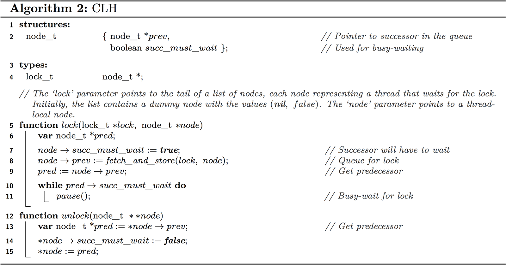

# Compte rendu TD2
###### D'Andréa William


## Partie 1. Mutex versus Spinlock

#### 1. Lancez le code avec quatre threads sur quatre cœurs en utilisant la commande `bench.sh stack_mutex.c`. Quelles performances obtenez-vous ?

```cpp 
pthread_mutex_t lock = PTHREAD_MUTEX_INITIALIZER;

typedef struct ListNode {
    Object value; 
    volatile struct ListNode *next;
} ListNode;	

int counter = 0;
ListNode guard CACHE_ALIGN = {0, null};
volatile ListNode *Head CACHE_ALIGN = &guard;
int64_t d1 CACHE_ALIGN, d2;

inline static void push(Object arg, int pid) {
    volatile ListNode *n = getAlignedMemory(CACHE_LINE_SIZE, sizeof(ListNode));
    n->value = (Object)arg;

    pthread_mutex_lock(&lock);

    n->next = Head;
    Head = n;

    pthread_mutex_unlock(&lock);
}

inline static Object pop(int pid) {
    Object result;

    pthread_mutex_lock(&lock);

    if (Head->next == null) 
        result = -1;
    else {
        result = Head->next->value;
        Head = Head->next;
    }

    pthread_mutex_unlock(&lock);

    return result;
}

```

Pour 10 millions d'exécutions (de push et de pop) sur 4 cœurs (donc 10M / 4 = 2.5M d'exécutions par cœur), nous avons
en moyenne un temps de :

```
Tmoyen_mutex_4_4 = (3169 + 3018 + 3162) / 3 = 3116 ns
```

#### 2. Copiez le fichier `stack_mutex.c` vers `stack_spinlock.c`. Dans ce fichier, remplacez le mutex POSIX par un spinlock 
basique que vous implémenterez vous-même. Pour implémenter le spinlock, il faut utiliser un `compare_and_swap`. Celui-ci 
est disponible sous la forme de builtin dans gcc. Ne faites surtout pas de `sleep()` ou `usleep()` pendant l'attente active, 
utilisez `rien` ou `_mm_pause()`. Avec quatre threads sur quatre cœurs, quelles performances obtenez-vous ?

###### Code : 
```cpp
bool lock = false;

typedef struct ListNode {
    Object value; 
    volatile struct ListNode *next;
} ListNode;	

ListNode guard CACHE_ALIGN = {0, null};
volatile ListNode *Head CACHE_ALIGN = &guard;
int64_t d1 CACHE_ALIGN, d2;


inline static void push(Object arg, int pid) {
    volatile ListNode *n = getAlignedMemory(CACHE_LINE_SIZE, sizeof(ListNode));
    n->value = (Object)arg;

    while (!__sync_bool_compare_and_swap(&lock, false, true)) {
        _mm_pause();
    }

    n->next = Head;
    Head = n;
    
    lock = false;
}

inline static Object pop(int pid) {
    Object result;

    while (!__sync_bool_compare_and_swap(&lock, false, true)) {
        _mm_pause();
    }

    if (Head->next == null) 
        result = -1;
    else {
        result = Head->next->value;
        Head = Head->next;
    }

    lock = false;

    return result;
}
```

###### Performance avec 4 threads sur 4 coeurs :
```
Tmoyen_spinlock_4_4 = (2800 + 2872 + 2911) / 3 = 2861 ns
```

#### 3. Essayez maintenant avec mille threads sur un seul cœur et comparer avec les performances des deux solutions : mutex POSIX et spinlock. Pouvez-vous expliquer les performances que vous observez ?

```
Tmoyen_mutex_1_1000 = (2715 + 2556 + 2686) / 3 = 2652 ns
Tmoyen_spinlock_1_1000 = (33043 + 23009 + 23691) / 3 = 26581 ns
```

Nous remarquons que l'implémentation du Spinlock est beaucoup plus lente que l'implémentation mutex dans le cas 
ou nous avons beaucoup de thread (et donc beaucoup de parallélisation). C'est normal car dans la situation ou
il y a beaucoup de threads, énormément de threads vont faire de l'écoute active en parallèle, de plus, à la sortie 
de chaque section critique, nous avons l'invalidation qui est envoyé à tout les autres threads en même temps. 
En fait, un des gros problèmes est que nous avons la variable `lock` de synchronisation qui est globale a tout le monde, 
nous avons ainsi un bottleneck. 


## Partie 2. Verrouillage CLH


#### 4. Créez maintenant stack_clh.c, dans lequel vous implémenterez l'algorithme CLH. Quelles performances obtenez-vous pour quatre threads sur quatre cœurs ? Pour mettre en oeuvre le "fetch and store", vous pouvez utiliser le builtin gcc : __sync_lock_test_and_set

###### Code
```cpp
typedef struct ListNode {
    Object value; 
    volatile struct ListNode *next;
} ListNode;	

typedef struct node_t {
    struct node_t *prev;
    bool succ_must_wait;
} node_t;

typedef node_t *lock_t;

int counter = 0;
ListNode guard CACHE_ALIGN = {0, null};
volatile ListNode *Head CACHE_ALIGN = &guard;
int64_t d1 CACHE_ALIGN, d2;

node_t locker = {null, false};


void lock(lock_t *lock, node_t *node) {
    node_t *pred;
    node->succ_must_wait = true;
    node->prev = __sync_lock_test_and_set(&lock, node);
    pred = node->prev;
    while ( pred->succ_must_wait ) {
        _mm_pause();
    }
}

void unlock(node_t **node) {
    node_t *pred = (*node)->prev;
    (*node)->succ_must_wait = false;
    *node = pred;
}


inline static void push(Object arg, int pid) {
    volatile ListNode *n = getAlignedMemory(CACHE_LINE_SIZE, sizeof(ListNode));
    n->value = (Object)arg;

    lock_t current_lck = malloc(sizeof(lock_t));

    lock(&locker, current_lck);

    n->next = Head;
    Head = n;

    unlock(current_lck);
}

inline static Object pop(int pid) {
    Object result;

    lock_t current_lck = malloc(sizeof(lock_t));
    lock(&locker, current_lck);

    if (Head->next == null) 
        result = -1;
    else {
        result = Head->next->value;
        Head = Head->next;
    }

    unlock(current_lck);
    return result;
}
```

###### Performance
```
Tmoyen_clh_4_4 = (2475 + 2122 + 2284) / 3 = 2293 ns
```

#### 5. Comparez les algorithmes MCS et CLH. En quoi sont-ils similaires ? Quelle est la différence principale entre les deux algorithmes ?

Globalement, les deux algorithmes sont relativement similaires, dans la mesure où ils vont executer des actions
en regardant l'état d'une "chaine de bloc", 
Quand on fait un lock, les deux algorithmes vont attendre tant que le dernier node de la file est lock (ici, on le
voit avec `succ_must_wait`). Cependant, une différence majeure est que, dans le cas de l'algorithme MCS, au niveau de l'unlock,
tant que nous n'avons pas un block voulant le verrou après nous, le thread va attendre. (`while (!node->next) {wait()}`).
Tandis que, de part l'architecture de l'algorithme CLH, comme dans chaque nouveau bloc, nous instantions la référence du bloc précédent
(et pas la référence du bloc suivant comme dans le cas de MCS), alors nous n'avons pas besoin d'attendre au moment de l'unlock.

### Partie 3. Verrouillage par ticket

#### 6. Créez finalement `stack_ticket.c`, qui utilisera votre implémentation du Ticket Lock. Les performances sont elles-meilleures, pires, ou similaires à celles de CLH ?

###### Code
```cpp
void ticketLock_init(int *next_ticket, int *now_serving) {
    *now_serving = *next_ticket = 0;
}

void ticketLock_acquire(int *next_ticket, int *now_serving) {
    int *my_ticket = __sync_fetch_and_add(&next_ticket, 1);
    while (*now_serving != *my_ticket) {
        _mm_pause();
        // sched_yield();
    }
}

void ticketLock_release(int *now_serving) {
    __sync_fetch_and_add(&now_serving, 1);
}


int now_serving = 0;
int next_ticket = 0;

inline static void push(Object arg, int pid) {
    volatile ListNode *n = getAlignedMemory(CACHE_LINE_SIZE, sizeof(ListNode));
    n->value = (Object)arg;

    ticketLock_acquire(&next_ticket, &now_serving);

    n->next = Head;
    Head = n;

    ticketLock_release(&now_serving);
}

inline static Object pop(int pid) {
    Object result;

    ticketLock_acquire(&next_ticket, &now_serving);

    if (Head->next == null) 
        result = -1;
    else {
        result = Head->next->value;
        Head = Head->next;
    }

    ticketLock_release(&now_serving);
 
    return result;
}
```

###### Performance
```
Tmoyen_ticket_4_4 = (2131 + 1787 + 1793) / 3 = 1904 ns
Tmoyen_ticket_1_1000 = (2675 + 2590 + 2648) / 3 = 2638 ns
```

Nous remarquons que les performances de l'algorithme de verrou par ticket est plus performant d'environ 17% par rapport
au veroru CLH. Ce n'est pas négligeable, de plus, il a l'air de bien répondre, même en monocoeur, à l'instar du spinlock. 

#### 7. Essayez de remplacer _mm_pause() par sched_yield() dans chacune des boucles à attente active de vos verrous. Lorsque vous lancez vos algorithmes avec 1000 threads sur un coeur, quelle différence observez-vous en termes de performances ?


```
Tmoyen_ticket_sched_1_1000 = (2662 + 2595 + 2563) / 3 = 2606 ns
```

Dans notre situation, la différence ne se fait presque pas ressentir. Même si `sched_yield()`à l'air de nous
donner de meilleures performances, nous ne pouvons pas conclure sur la véracité de cette performance. 
